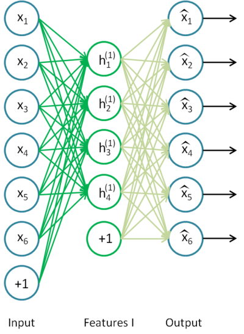
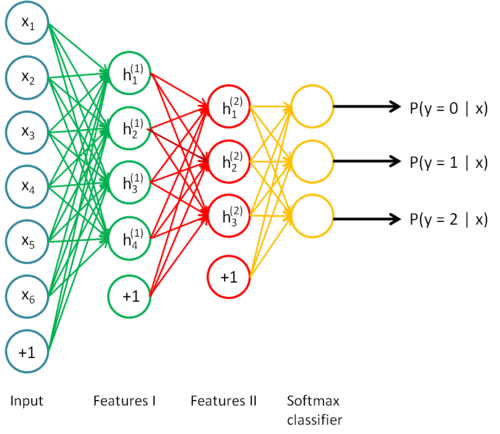

## 栈式自编码算法（Stacked Autoencoders）

### 1. 概述（Overview）

逐层贪婪训练法依次训练网络的每一层，进而预训练整个深度神经网络。在本节中，我们将会学习如何将自编码器“栈化”到逐层贪婪训练法中，从而预训练（或者说初始化）深度神经网络的权重。

栈式自编码神经网络是一个由多层稀疏自编码器组成的神经网络，其前一层自编码器的输出作为其后一层自编码器的输入。对于一个 $\textstyle n$ 层栈式自编码神经网络，我们沿用自编码器一章的各种符号，假定用 $\textstyle W^{(k, 1)}, W^{(k, 2)}, b^{(k, 1)}, b^{(k, 2)}$ 表示第 $\textstyle k$ 个（译者注：个人认为这里应该是第 $k$ 层）自编码器对应的 $\textstyle W^{(1)}, W^{(2)}, b^{(1)}, b^{(2)}$ 参数，那么该栈式自编码神经网络的编码过程就是，按照从前向后的顺序执行每一层自编码器的编码步骤：

$$
\begin{align}
a^{(l)} = f(z^{(l)}) \\
z^{(l + 1)} = W^{(l, 1)}a^{(l)} + b^{(l, 1)} 
\end{align}
$$

同理，栈式神经网络的解码过程就是，按照从后向前的顺序执行每一层自编码器的解码步骤：

$$
\begin{align} 
a^{(n + l)} = f(z^{(n + l)}) \\ 
z^{(n + l + 1)} = W^{(n - l, 2)}a^{(n + l)} + b^{(n - l, 2)} 
\end{align}
$$

其中， $\textstyle a^{(n)}$ 是最深层隐藏单元的激活值，其包含了我们感兴趣的信息，这个向量也是对输入值的更高阶的表示。

通过将 $\textstyle a^{(n)}$ 作为 SoftMax 分类器的输入特征，可以将栈式自编码神经网络中学到的特征用于分类问题。

### 2. 训练（Training）

一种比较好的获取栈式自编码神经网络参数的方法是采用逐层贪婪训练法进行训练。即先利用原始输入来训练网络的第一层，得到其参数 $\textstyle W^{(1,1)}, W^{(1,2)}, b^{(1,1)}, b^{(1,2)}$ ；然后网络第一层将原始输入转化成为由隐藏单元激活值组成的向量（假设该向量为 $A$ ），接着把 $A$ 作为第二层的输入，继续训练得到第二层的参数 $\textstyle W^{(2,1)}, W^{(2,2)}, b^{(2,1)}, b^{(2,2)}$ ；最后，对后面的各层采用同样的策略，即将前层的输出作为下一层输入的方式依次训练。

对于上述训练方式，在训练每一层参数的时候，会固定其它各层参数保持不变。所以，如果想得到更好的结果，在上述预训练过程完成之后，可以通过反向传播算法同时调整所有层的参数以改善结果，这个过程一般被称作“微调（ fine-tuning ）”。

实际上，使用逐层贪婪训练方法将参数训练到快要收敛时，应该使用微调。反之，如果直接在随机化的初始权重上使用微调，那么会得到不好的结果，因为参数会收敛到局部最优。

如果你只对以分类为目的的微调感兴趣，那么惯用的做法是丢掉栈式自编码网络的“解码”层，直接把最后一个隐藏层的 $\textstyle a^{(n)}$ 作为特征输入到 SoftMax 分类器进行分类，这样，分类器（ SoftMax ）的分类错误的梯度值就可以直接反向传播给编码层了。

### 3. 具体实例（Concrete example）

让我们来看个具体的例子，假设你想要训练一个包含两个隐含层的栈式自编码网络，用来进行 MNIST 手写数字分类（这将会是你的下一个练习）。 首先，你需要用原始输入 $\textstyle x^{(k)}$ 训练第一个自编码器，它能够学习得到原始输入的一阶特征表示 $\textstyle h^{(1)(k)}$ （如下图所示）。

>这里的“一阶特征”就是输入时的特征（输入层），“二阶特征”是网络第二层（第一个隐含层）的特征。

接着，你需要把原始数据输入到上述训练好的稀疏自编码器中，对于每一个输入 $\textstyle x^{(k)}$ ，都可以得到它对应的一阶特征表示 $\textstyle h^{(1)(k)}$ 。然后你再用这些一阶特征作为另一个稀疏自编码器的输入，使用它们来学习二阶特征 $\textstyle h^{(2)(k)}$ 。（如下图所示）

同样，再把一阶特征输入到刚训练好的第二层稀疏自编码器中，得到每个 $\textstyle h^{(1)(k)}$ 对应的二阶特征激活值 $\textstyle h^{(2)(k)}$ 。接下来，你可以把这些二阶特征作为 SoftMax 分类器的输入，训练得到一个能将二阶特征映射到数字标签（译者注：样本类型）的模型。

如下图所示，最终，你可以将这三层结合起来构建一个包含两个隐藏层和一个最终 SoftMax 分类器层的栈式自编码网络，这个网络能够如你所愿地对 MNIST 数字进行分类。

### 4. 讨论（Discussion）

栈式自编码神经网络具有强大的表达能力及深度神经网络的所有优点。

更进一步，它通常能够获取到输入的“层次型分组”或者“部分-整体分解”结构。为了弄清这一点，回顾一下，自编码器倾向于学习得到能更好地表示输入数据的特征。因此，栈式自编码神经网络的第一层会学习得到原始输入的一阶特征（比如图片里的边缘），第二层会学习得到二阶特征，该特征对应一阶特征里包含的一些模式（比如在构成轮廓或者角点时，什么样的边缘会共现）。栈式自编码神经网络的更高层还会学到更高阶的特征。

举个例子，如果网络的输入数据是图像，网络的第一层会学习如何去识别边，第二层一般会学习如何去组合边，从而构成轮廓、角等。更高层会学习如何去组合更形象且有意义的特征。例如，如果输入数据集包含人脸图像，更高层会学习如何识别或组合眼睛、鼻子、嘴等人脸器官。 